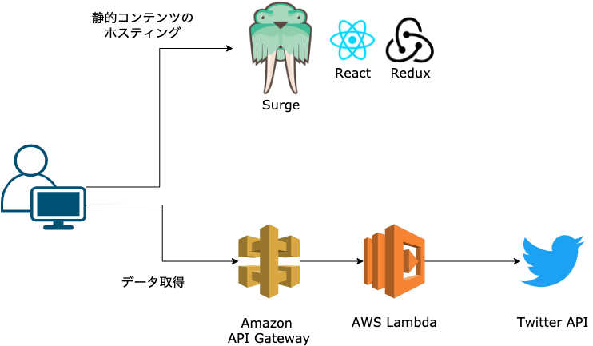

# About
Twitter でハッシュタグ「#100DaysOfStarbucks」をつけて Starbucks についてつぶやいたものをまとめて表示しているWebサイトです。

***

# Tech / 使用した技術
AWS Lambda + API Gateway を利用して、サーバレスアーキテクチャで Twitter API からデータを取得しています。
コンテンツは [Surge](https://surge.sh/)  という静的コンテンツのホスティングサービスに置いており、React で動いてます。
パララクスでちょっとオシャレに演出してます。

- React
- Redux
- AWS Lambda + API Gateway
- Twitter API

### Others / その他
- 最初は Express でサーバ立てて動かしていたので、残骸のコードがGitHubに上がっていますが、現在は AWS Lambda に移行済。
- Express は使っていませんが、コメントを１行書き換えるだけで Express 経由で動くように残しています。

***

# Link / リンク
- [Site](https://koeri.surge.sh)
- [GitHub](https://github.com/nouvelle/100days-Of-Starbucks)