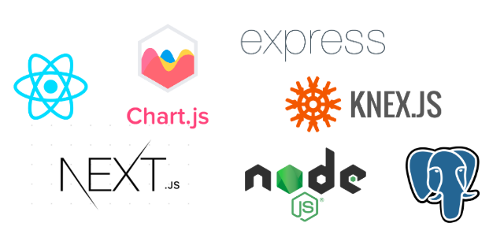

# About / これについて
日々の支出を記録し、月々の支出額をチャートでも表現することができるアプリです。

***

# Tech / 使用した技術
フロントエンドは、React/Next.js、バックエンドは Express を使用し、PostgreSQL にデータを保存しています。

- React
- Next.js
- Chart.js
- Node.js
- Express
- Knex.js
- PostgreSQL

***

# Link / リンク
- [GitHub](https://github.com/nouvelle/money-track)