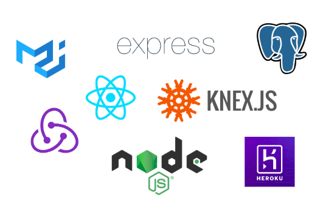

# About / これについて
If you use this app, you can save the URLs you want to read later and read them together later.
You can save what you have read, so you can read it immediately if you want to read it again.  
このアプリを使えば、後で読みたいURLを保存し、後でまとめて読むことができます。
読んだものも保存しておくことができるので、また読みたくなったらすぐに読むことができます。

***

# Tech / 使用した技術
フロントエンドは、React/Redux、バックエンドは Express を使用し、PostgreSQL にデータを保存しています。
コンテンツは Heroku にデプロイしています。

- React
- Redux
- Material-UI
- Node.js
- Express
- Knex.js
- PostgreSQL
- Heroku

***

# Link / リンク
- [Site](https://coffeee-time.herokuapp.com/)
- [GitHub](https://github.com/nouvelle/coffee-time)